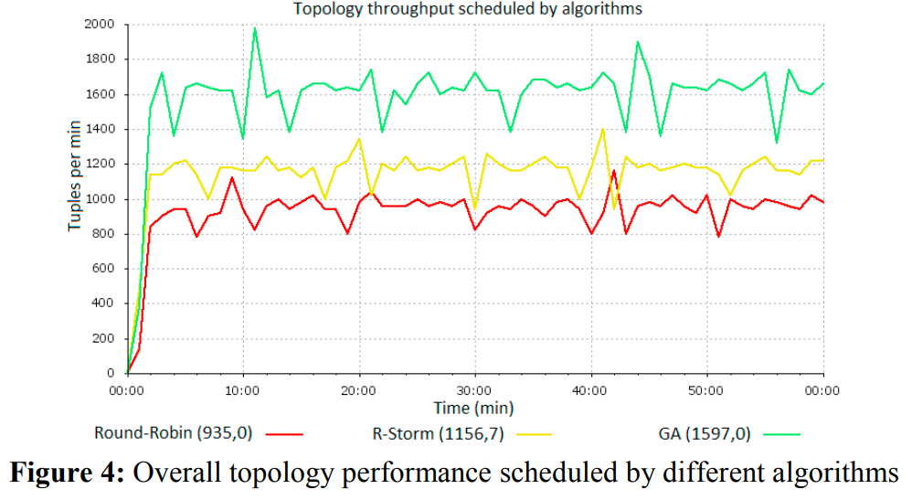

# StreamSim

The project contains:
 - disttributed Streaming Data Porcessing SImulator
 - simple visualization
 - scheduling algorithms for Stream Data Processing Problem (R-Storm and GA)

Was used in paper:
https://www.sciencedirect.com/science/article/pii/S1877050917308773/pdf?md5=2bc0a4e54ad4d42a61d108dd083f3a38&pid=1-s2.0-S1877050917308773-main.pdf

